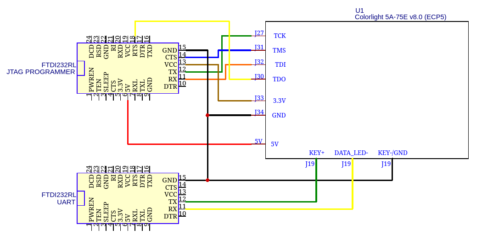

# RISC-V on Colorlight 5A-75E

Demonstration on using a soft core ([**VexRiscv**](https://github.com/SpinalHDL/VexRiscv))
built with [**LiTex**]((https://github.com/enjoy-digital/litex)) in a **Colorlight 5A-75E** board (Lattice ECP5).

## Info

- There is no led and no user button - both pins are used by the UART.

| name      | pin | note            |
|-----------|-----|-----------------|
| clk25     | P6  | 25MHz clock     |
| UART TX   | T6  | J19 (DATA_LED-) |
| UART RX   | R7  | J19 (KEY+)      |

## Prerequisites

### hardware
- Colorlight 5A-75E (duh) (with JTAG header pins)
- JTAG programmer (I used FT232RL (*not recommended, very slow!!!*))
  - USB Blaster also supported, check [USB Blaster section](#usb-blaster) 
- USB <-> UART converter (i also used another FT232RL)

### software

- LiteX and Migen tools (see [litex wiki](https://github.com/enjoy-digital/litex/wiki/Installation) for installation instructions)
- RISC-V toolchain (check litex wiki aswell)
- yosys, nextpnr and prjtrellis (ECP5 toolchain)
- openFPGALoader

### Build gateware/bitstream
```bash
./base.py --build
```

### Build firmware (C code)
```bash
cd firmware && make
```

## Load bitstream into FPGA
```bash
./base.py --load [--cable jtagCable]
```
where *jtagCable* depends on your JTAG probe. 

### JTAG cable
If `--cable` is not provided, `ft232RL` will be used by default.

#### FTDI232RL
Make sure the pin mapping is the following:
| Connector | Function | FTDI232RL |
|-----------|----------|-----------|
| J27       | TCK      | TX        | 
| J31       | TMS      | CTS       | 
| J32       | TDI      | RX        | 
| J30       | TDO      | RTS       | 
|           |          |           |
| J33       | 3.3V     | VCC       |
| J34       | GND      | GND       |
|           |          |           |
| 5V        | POWER    | 5V        |



#### USB Blaster
If you want to use USB Blaster, you need to have an environment variable `QUARTUSPATH` with
your quartus installation path, 
e.g: add `export QUARTUSPATH=/home/roby/intelFPGA_lite/22.1std/quartus` to `~/.bashrc`.

## Load firmware
```bash
make run DEVICE=... LXTERM_DIR=...
```
where:
  - `DEVICE` is your USB <-> UART converter device (default = `/dev/ttyUSB1`).
  - `LXTERM_DIR` is the path where you have `litex_term.py` script (default = `litex_term.py`).

Example:
```bash
make run DEVICE=/dev/ttyUSB1 LXTERM_DIR=/home/user/litex/litex/tools/litex_term.py
```

## Boot
After loading the firmware, you can type `reboot` and you should be able to see something like this:
```bash
❯ make run DEVICE=/dev/ttyUSB2 LXTERM_DIR=/home/roby/litex/litex/tools/litex_term.py
 CC       main.o
 CC       firmware.elf
/usr/lib/gcc/riscv64-linux-gnu/12.2.0/../../../../riscv64-linux-gnu/bin/ld: warning: firmware.elf has a LOAD segment with RWX permissions
chmod -x firmware.elf
 OBJCOPY  firmware.bin
chmod -x firmware.bin
/home/roby/roby/litex/litex/tools/litex_term.py /dev/ttyUSB2 --kernel firmware.bin
  
$ >reboot

        __   _ __      _  __
       / /  (_) /____ | |/_/
      / /__/ / __/ -_)>  <
     /____/_/\__/\__/_/|_|
   Build your hardware, easily!

 (c) Copyright 2012-2022 Enjoy-Digital
 (c) Copyright 2007-2015 M-Labs

 BIOS built on Jan 19 2023 17:51:33
 BIOS CRC passed (6903958b)

 LiteX git sha1: c8343879

--=============== SoC ==================--
CPU:            VexRiscv @ 25MHz
BUS:            WISHBONE 32-bit @ 4GiB
CSR:            32-bit data
ROM:            32.0KiB
SRAM:           8.0KiB
MAIN-RAM:       16.0KiB

--========== Initialization ============--
Memtest at 0x40000000 (16.0KiB)...
  Write: 0x40000000-0x40004000 16.0KiB   
   Read: 0x40000000-0x40004000 16.0KiB   
Memtest OK
Memspeed at 0x40000000 (Sequential, 16.0KiB)...
  Write speed: 39.7MiB/s
   Read speed: 19.8MiB/s

--============== Boot ==================--
Booting from serial...
Press Q or ESC to abort boot completely.
sL5DdSMmkekro
[LITEX-TERM] Received firmware download request from the device.
upload
[LITEX-TERM] Uploading firmware.bin to 0x40000000 (5568 bytes)...
[LITEX-TERM] Upload calibration... (inter-frame: 10.00us, length: 64)
[LITEX-TERM] Upload complete (9.9KB/s).
[LITEX-TERM] Booting the device.
[LITEX-TERM] Done.
Executing booted program at 0x40000000

--============= Liftoff! ===============--

Jan 19 2023 22:19:42


LiteX RISC-V SoC on Colorlight 5A-75E

Available commands:
help                            - this command
reboot                          - reboot CPU
$ >
```

### References
- [Using FTDI232RL as a JTAG programmer (my blogpost)](https://roby2014-me.vercel.app/programming-a-colorlight-5a-75e-board-ECP5-FPGA-with-open-source-tools/#using-ftdi232rl-as-a-jtag-programmer)
- [VexRiscv](https://github.com/SpinalHDL/VexRiscv)
- [litex](https://github.com/enjoy-digital/litex)
- [openFPGALoader](https://github.com/trabucayre/openFPGALoader)
- [litexOnColorlightLab004](https://github.com/trabucayre/litexOnColorlightLab004)
- [riscvOnColorlight-5A-75B](https://github.com/ghent360/riscvOnColorlight-5A-75B)
